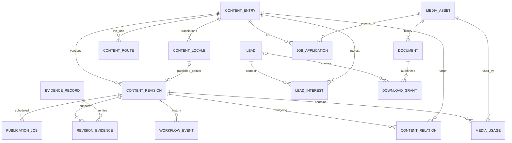

# 02 — CMS, backend và schema đề xuất

Đây là **logical schema có kiểu dữ liệu và ràng buộc**, làm đầu vào cho migration/OpenAPI; không phải schema đã tồn tại trong backend VCCI. Chọn mô hình quan hệ, định hướng PostgreSQL; có thể chuyển sang database khác nhưng phải giữ các invariant. Chưa khóa framework backend hoặc ORM khi chưa có source backend và yêu cầu vận hành.

## 1. Phần nào cần CMS/backend?

| Khu vực | CMS biên tập | Backend riêng | Cách triển khai |
|---|---|---|---|
| Home, What We Do, các hub | Có | Page composition/read model | Heading, visual, selected references, thứ tự section có giới hạn |
| 7 business solutions | Có | Collection `solution` | Template cố định; quan hệ ngành/case/capability |
| 8 technology capabilities | Có | Collection `capability` | Deliverable, process, tool, phase |
| Talent, Training | Có | `talent`, `training` | Track/role/model nested data; chưa cần LMS hoặc talent marketplace |
| Industries | Có | `industry` + readiness gate | Không publish từ tên ngành trống |
| Products/platforms | Có | `product`, version/docs/feature contracts | Category là taxonomy; demo là lead workflow |
| Case studies | Có | `case_study`, evidence/proof | Chọn named/anonymous; quan hệ đa chiều |
| Insights, reports, events | Có | `article`, `report`, `event` | Event đăng ký ngoài/inquiry ở MVP; report private grant khi gated |
| About/Story/Mission | Có | `company_page` | Các section được phép theo template |
| Leadership/partners/locations | Có | `person`, `organization`, `location` | Tái sử dụng ở author/speaker/quote/footer |
| Careers | Có | `job` + application workflow | Job public; CV/application private |
| Trust/legal | Có, có reviewer | `trust_page`, `legal_page`, policy version | Không chỉ là ô HTML tự do |
| Menu/footer/SEO/redirect | Có | `navigation`, `site_settings`, redirects | Lock top-level slots; publish theo locale |
| Contact/consultation/demo | CMS chỉnh copy/form preset | Leads, delivery outbox, spam controls | Form fields allowlist, không cho editor thêm thu thập tùy ý |
| Search/sitemaps/related content | Không biên tập kết quả trực tiếp | Derived từ published snapshots | CMS chỉ pin/rank/curate theo contract |
| Cookie preferences/notice | Có nội dung + category config | Consent events/config version | Triển khai theo công cụ thực tế và policy đã duyệt |
| 404/error/loading/UI tokens | Strings locale và thiết kế code | Không cần collection riêng | Không biến mọi label/button thành một bảng database |

## 2. UI quản trị CMS

### 2.1. Sidebar và màn hình danh sách

Sidebar: **Overview / Website Pages / Solutions & Capabilities / Industries / Products / Client Success / Insights & Events / Company & Careers / Trust & Legal / Media / Leads & Applications / Navigation & SEO / Access & Audit**. Trong Solutions & Capabilities có Talent/Training. Có thể collapse nhóm, global search, locale switch và preview site.

List layout: page title + “Create”; filter bar search/type/status/locale/owner/updated date; table title, template/type, VI status, EN status, owner, updated, review due; row actions Edit, Preview, Duplicate draft, Archive. Có bulk assign/submit review; bulk publish chỉ cho người có quyền và mỗi item phải qua gate.

Không dùng card dashboard với số liệu hardcode. Overview lấy counts draft/review/scheduled/broken refs/new leads/stale policy từ backend; metric kinh doanh cần event thực tế.

### 2.2. Editor template

Desktop ba vùng: outline section 220px; form trung tâm; panel publish/reference 300px. Mobile/tablet chuyển outline và panel sang drawer.

Tabs: **Content / Relationships / Card & Media / SEO / Translations / Revisions**. Phần Content có preview từng section; relation picker tìm entry theo type/status/locale và hiển thị label, không bắt editor nhớ UUID.

Publish panel: current locale, owner, workflow state, validation result, last published revision, schedule timezone, review notes; nút Save draft → Submit for review → Approve → Publish theo quyền. Preview dùng revision token phía server, không bật public query `?draft=true`.

Revision diff phải thấy thay đổi text, reference, SEO và ảnh; restore tạo revision mới từ bản cũ, không sửa lịch sử. Xung đột hai editor báo conflict bằng version/ETag, không ghi đè âm thầm.

### 2.3. Màn hình riêng theo collection

| Module | Điểm UI đặc thù |
|---|---|
| Home/hub | Danh sách section có thumbnail preview, locked required slots, drag reorder trong vùng được phép, ref picker với count limit |
| Solution/capability/industry | Structured fields + relation graph gọn “Appears on / Related to”; readiness checklist ngành |
| Product | Tabs Features/Integrations/Deployment/Documents; badge live/planned; stable core và demo readiness; version hiện hành |
| Case | 9 phần theo sitemap; client visibility; metric editor baseline/result/unit/scope; evidence/approval panel; anonymous preview |
| Article/report/event | Body editor theo block; author/topic; report access/version/file; event timezone/status/agenda/speaker |
| Job | Job status open/closed; dates; responsibilities; Apply preset; applications count mở màn hình riêng |
| Trust/legal | Policy version/effective date/review due/reviewer; public preview loại bỏ evidence nội bộ |
| Media | Grid/list, search/type/access/locale; crop/focal point/alt per locale; usage report; không delete file đang được published revision sử dụng |
| Leads | Table + detail drawer; source/context, owner, status, timeline, delivery state; filter consultation/demo/contact/download; không chung với ứng viên |
| Applications | Recruiter-only table; job, stage, submitted, private CV access; audit download; không xuất hiện trong marketing lead export |
| Navigation | Hai cây VI/EN cùng structure keys; six header slots locked; chọn content reference và custom external link có kiểm tra |
| Redirects | Old path → target entry/URL, locale, 301/308, collision/loop check; CSV import có preview |

### 2.4. Roles và workflow

| Role | Quyền mặc định |
|---|---|
| Admin | Quản lý account/role/config, recovery; không mặc định bỏ qua các gate nội dung |
| Editor | Tạo/sửa draft theo collection; submit review; không publish |
| Reviewer/Domain owner | Review/approve đúng phạm vi; xác nhận accuracy/evidence; không sửa role |
| Publisher | Publish/schedule/unpublish bản đã approve; quản lý redirect |
| Translator | Sửa locale được giao; không sửa nguồn/approval |
| Sales | Đọc/assign/update lead; export riêng quyền; không xem CV |
| Recruiter | Job và applications; không export marketing leads mặc định |
| Trust reviewer | Approve trust/legal/proof scope được giao |

Permission dạng `resource:action`, có scope locale/type/team nếu cần. **Backend enforce trên từng operation**, UI chỉ ẩn/disable tương ứng. Không dựa vào sidebar hoặc Zustand để bảo vệ nội dung/lead.

State cho từng locale revision: `draft → in_review → approved → scheduled → published`, cùng `rejected`, `superseded`, `archived`. Sửa bản đã published tạo draft mới; public vẫn đọc revision đã publish. Sửa bản approved phải tạo revision mới và cần review lại. Bản được reject quay về draft qua revision mới. Content identity có lifecycle `active|archived`; unpublish gỡ pointer của locale, không xóa audit/revision.

## 3. Quy ước schema

- `uuid`: opaque ID; `text`: UTF-8; `timestamptz`: UTC; `date`: ngày lịch; `integer`; `numeric`; `boolean`; `jsonb` dùng cho các payload đã có contract.
- `!` = NOT NULL; `?` = nullable; array mặc định `[]`, object theo schema; không dùng chuỗi rỗng thay null với dữ liệu không có.
- Tất cả bảng có ID dùng UUID do server sinh, trừ unique keys được ghi rõ. `created_at!` và `updated_at!` ở bảng mutable; bảng append-only chỉ có `created_at!`.
- Nội dung dịch theo entry identity; các related references dùng identity ID, không dùng slug hoặc title. Slug chỉ để resolve route.
- Revision payload lưu **bản snapshot đầy đủ**, schema_version rõ. Service validate bằng JSON Schema/Zod tương đương; payload field không nằm trong allowlist bị reject.
- Không dựa vào JSON blob không được validate. Các collection contracts ở mục 5 phải thành schema cụ thể trước implementation; đó là acceptance gate của backend.

## 4. Relational schema nền tảng

### 4.1. Content, locale, revision và publish

| Bảng | Fields | Ràng buộc/ý nghĩa |
|---|---|---|
| `content_entries` | `id uuid!`, `type text!`, `internal_key text!`, `lifecycle active|archived!`, `owner_id uuid?`, `created_by uuid!`, timestamps | `UNIQUE(internal_key)`; type theo enum mục 5; internal_key ổn định, không dùng làm URL |
| `content_locales` | `entry_id uuid!`, `locale vi|en!`, `working_revision_id uuid?`, `published_revision_id uuid?`, `lock_version integer!` | PK `(entry_id,locale)`; pointers phải trỏ revision cùng entry/locale; FK kép; lock_version tăng khi thay đổi |
| `content_revisions` | `id uuid!`, `entry_id uuid!`, `locale vi|en!`, `revision_no integer!`, `schema_version integer!`, `title text!`, `slug text?`, `summary text?`, `card jsonb!`, `seo jsonb!`, `data jsonb!`, `created_by uuid!`, `created_at timestamptz!` | `UNIQUE(entry_id,locale,revision_no)`; append-only; slug null cho singleton/nonroute; payload đã validate theo type |
| `revision_workflow_events` | `id uuid!`, `revision_id uuid!`, `from_state text?`, `to_state text!`, `actor_id uuid!`, `note text?`, `created_at!` | Append-only; service kiểm tra transition; state hiện hành derived/cached transactionally, không chỉnh lịch sử |
| `content_relations` | `revision_id uuid!`, `relation_key text!`, `target_entry_id uuid!`, `sort_order integer!`, `role text?` | PK `(revision_id,relation_key,target_entry_id)`; FK source revision/target entry; registry source/target types; không self/cycle khi quan hệ không cho phép |
| `content_routes` | `id uuid!`, `entry_id uuid!`, `locale vi|en!`, `path text!`, `published_revision_id uuid!` | `UNIQUE(locale,path)`; chỉ chứa route live; path không chứa locale/query; target revision đúng entry/locale; một canonical route cho một entry/locale |
| `publication_jobs` | `id uuid!`, `revision_id uuid!`, `action publish|unpublish!`, `run_at timestamptz!`, `status pending|running|succeeded|failed|cancelled!`, `requested_by uuid!`, `attempts integer!`, `last_error text?` | Worker idempotent; schedule lưu UTC, UI hiển thị timezone; publish check approval lại khi chạy |
| `publication_events` | `id uuid!`, `entry_id uuid!`, `locale!`, `revision_id uuid?`, `event_type!`, `created_at!` | Outbox cho invalidation/search/sitemap; event ghi trong transaction publish, retry dedup theo event ID |
| `redirects` | `id uuid!`, `locale vi|en!`, `source_path text!`, `target_entry_id uuid?`, `target_path text?`, `status_code 301|308!`, `is_active boolean!`, timestamps | Exactly one target; source unique khi active; collision với live route bị reject; không loop hoặc redirect chain mới |

`content_entries.type` gồm: `landing`, `challenge`, `solution`, `capability`, `talent`, `training`, `industry`, `product`, `case_study`, `article`, `report`, `event`, `company_page`, `person`, `organization`, `location`, `job`, `trust_page`, `legal_page`, `taxonomy`, `navigation`, `site_settings`, `form_preset`.

Các dữ liệu chung hai locale như external product code không được sửa chéo âm thầm: lưu master value ở một settings/service domain hoặc dùng form thao tác cập nhật draft của cả hai locale, sau đó review/publish độc lập. Public chỉ đọc snapshot của locale đang request. Không có field global mutable làm bản EN live tự đổi khi editor chỉ sửa VI draft.

**Lưu relationship:** client editor gửi `data` và `relations` cùng revision request. Backend tách refs sang `content_relations`; payload không lưu thêm bản copy của relation IDs. Mảng nested thực sự thuộc một entry (features/curriculum/steps) ở `data`. Product feature image refs và media refs được trích vào bảng `media_usages` để bảo vệ/xác minh usage.

### 4.2. Media, document và evidence

| Bảng | Fields | Rules |
|---|---|---|
| `media_assets` | `id uuid!`, `storage_key text!`, `original_name text!`, `mime text!`, `size_bytes bigint!`, `checksum text!`, `width integer?`, `height integer?`, `access public|private!`, `scan_status pending|clean|blocked!`, `rights_status pending|approved|expired!`, `rights_expires_at timestamptz?`, `uploaded_by uuid!`, timestamps | unique storage key; binary version immutable; thay file tạo asset mới; file public phải clean/rights approved khi publish |
| `media_locales` | `asset_id uuid!`, `locale!`, `alt text?`, `caption text?`, `credit text?` | PK asset/locale; values dùng làm default editor, revision snapshot giữ alt/caption thực tế để tránh mutate live |
| `media_usages` | `revision_id uuid!`, `asset_id uuid!`, `field_path text!`, `purpose cover|inline|document|evidence!` | PK revision/field_path/asset; service sync cùng revision; kiểm tra access theo purpose |
| `documents` | `id uuid!`, `asset_id uuid!`, `version_label text!`, `locale!`, `page_count integer?`, `access_mode public|gated|private!`, `checksum text!`, `created_at!` | Immutable version; document locale phải đúng report; gated/private asset không public; title/description localized ở report/product payload |
| `evidence_records` | `id uuid!`, `kind metric|quote|logo|certificate|claim|case_clearance!`, `private_asset_id uuid?`, `source_url text?`, `notes text?`, `verified_by uuid?`, `verified_at timestamptz?`, `expires_at timestamptz?`, `status pending|approved|rejected|revoked!`, timestamps | Ít nhất asset/source/notes mô tả nguồn; private notes không bao giờ serialize public; revoked/expired phải chặn publish mới và cảnh báo content live |
| `revision_evidence` | `revision_id uuid!`, `field_path text!`, `evidence_id uuid!`, `public_citation text?` | PK revision/field_path/evidence; public citation riêng với nguồn nội bộ; clearance phải gắn đúng claim/asset |

Không cho `public → private` trên một asset đã cache công khai rồi gọi đó là bảo mật; thu hồi public asset cần invalidate CDN và quy trình replacement. Những file biết sẽ gated/private phải private ngay từ upload. Bản scan không phải public preview.

### 4.3. Accounts, audit, submissions và delivery

| Bảng | Fields chính | Rules |
|---|---|---|
| `cms_users` | `id`, `email text!`, `display_name text!`, `status active|disabled!`, `identity_subject text?`, timestamps | email normalized unique; liên kết identity provider/session service; không lưu mật khẩu dạng text trong CMS |
| `cms_roles` / `cms_permissions` | role `id,key,name`; permission `id,key`; keys unique | permission registry backend |
| `cms_user_roles` / `cms_role_permissions` | user_id/role_id; role_id/permission_id; optional scope jsonb theo allowlist | Composite PK; enforce backend; mọi thay đổi audit |
| `audit_events` | `id`, `actor_id?`, `action`, `resource_type`, `resource_id?`, `request_id`, `redacted_diff jsonb`, `created_at` | Append-only; không ghi token/password/CV/email body đầy đủ |
| `leads` | `id`, `type contact|consultation|demo|team_request|training_request|report_download!`, `locale!`, `full_name!`, `email!`, `company?`, `phone?`, `job_title?`, `message?`, `timeline?`, `budget_range?`, `status new|qualified|in_progress|closed|spam!`, `owner_id?`, `form_revision_id!`, `source_entry_id?`, `source_path?`, `utm jsonb?`, `idempotency_key!`, timestamps | Unique idempotency key theo endpoint; bounded text; no raw URL chứa PII; source refs validated; message có thể không bắt buộc ở demo/download |
| `lead_interests` | `lead_id uuid!`, `entry_id uuid!`, `kind solution|industry|product|capability|talent|training|report!` | PK lead/entry/kind; allowed target type; demo cần exactly one published demo-enabled product |
| `lead_events` | `id`, `lead_id`, `actor_id?`, `event_type`, `note?`, `created_at` | Append-only timeline; note restricted; không tự publish thành testimonial |
| `job_applications` | `id`, `job_entry_id!`, `job_revision_id!`, `locale!`, `full_name!`, `email!`, `phone?`, `cv_asset_id!`, `portfolio_url?`, `cover_note?`, `status new|reviewing|interview|offer|rejected|withdrawn!`, `owner_id?`, `idempotency_key!`, timestamps | Job open tại submit; CV private/clean; recruiter scope; snapshot revision giữ JD ứng viên đã đọc |
| `consent_events` | `id`, `subject_type lead|application|visitor!`, `subject_id uuid?`, `visitor_key text?`, `purpose text!`, `choice granted|denied|withdrawn|acknowledged!`, `notice_revision_id!`, `form_revision_id?`, `locale!`, `created_at!` | Subject hoặc visitor, không cả hai; event append-only; purpose phân biệt inquiry notice/marketing/recruitment/analytics; không xem một checkbox là đồng ý tất cả |
| `download_grants` | `id`, `document_id!`, `lead_id?`, `token_hash!`, `expires_at!`, `revoked_at?`, `max_downloads integer!`, `download_count integer!`, `created_at!` | Atomic increment; opaque token, không lưu raw token; enforce grant trước trả signed storage URL |
| `delivery_outbox` | `id`, `event_key!`, `destination crm|email!`, `resource_type!`, `resource_id!`, `status pending|processing|sent|failed!`, `attempts!`, `next_attempt_at?`, `last_error?`, `created_at!` | Unique event_key/destination; record theo ref, không duplicate PII payload không cần thiết; retry/backoff/dead-letter |
| `search_documents` | `entry_id`, `locale`, `revision_id`, `type`, `path`, `title`, `summary`, `search_text`, `facets jsonb`, `published_at` | PK entry/locale; derived published projection; remove trên unpublish; hỗ trợ tìm không dấu VI nhưng không mất text gốc |

`source_path`, UTM, portfolio URL đều validate scheme/length và chỉ giữ allowlist fields. Không thu IP/user agent vô thời hạn mặc định. Retention lead/CV/consent/audit phải có cấu hình theo policy doanh nghiệp được duyệt trước go-live; hỗ trợ export/xóa/ẩn danh và backup deletion lifecycle. Đây là yêu cầu hệ thống, không xác định thay doanh nghiệp thời hạn pháp lý.

### 4.4. Index và ràng buộc cần triển khai

- `content_entries(type,lifecycle)`, `content_revisions(entry_id,locale,revision_no DESC)`; revision immutable.
- Route unique `(locale,path)`; normalize leading/trailing slash, Unicode, case policy; reserved route collision được kiểm tra bằng manifest. Slug trùng không được xử lý bằng “lấy bản đầu tiên”.
- `content_relations(target_entry_id,relation_key)` cho reverse lookups; sort_order trong mỗi source/key.
- `publication_jobs(status,run_at)`; outbox `(status,next_attempt_at)`; lead `(status,created_at)`, `(owner_id,created_at)`, application `(job_entry_id,status,created_at)`.
- Full-text index cho title/summary/body theo ngôn ngữ; accent-insensitive normalization cho VI, không giả định analyzer tiếng Anh hiểu tiếng Việt. Pagination ổn định bằng published_at/id hoặc sort/id.
- FKs restrict xóa content/media đang referenced; archive có kiểm tra dependencies. Không cascade xóa evidence, submission, audit khi xóa page.
- `documents.access_mode != public` yêu cầu private asset; private URL không được xuất hiện trong public schema projection.

## 5. Collection schemas: fields cho từng loại trang

Các fields dưới đây thuộc `content_revisions.data`, trừ common fields và các relations đã tách bảng. Tất cả payload có `schema_version=1`; unknown fields reject. Required (!), optional (?) được ghi để backend triển khai, không chỉ là gợi ý giao diện.

### 5.1. Common contracts

```ts
type Locale = 'vi' | 'en';
type UUID = string;
type MediaRef = { asset_id: UUID; alt: string; caption?: string;
  decorative: boolean; focal_x: number; focal_y: number }; // focal 0..1
type Link =
  | { kind: 'entry'; entry_id: UUID; anchor?: string }
  | { kind: 'external'; url: string; new_tab: boolean }
  | { kind: 'action'; action: 'consultation'|'demo'|'contact'|'team'|'training'; context_entry_id?: UUID };
type CTA = { label: string; link: Link };
type Card = { title?: string; summary?: string; image?: MediaRef; eyebrow?: string };
type SEO = { title: string; description: string; og_image?: MediaRef;
  indexing: 'index'|'noindex' }; // canonical/hreflang derived từ routes, không nhập URL tùy ý
type Hero = { eyebrow?: string; headline: string; description: string;
  visual?: MediaRef; primary_cta: CTA; secondary_cta?: CTA;
  variant: 'split'|'editorial'|'compact'|'product' };
type TextItem = { id: UUID; title: string; description: string };
type Step = TextItem & { deliverables: string[] };
type FAQ = { id: UUID; question: string; answer: RichText };
type Architecture = { image: MediaRef; description: string;
  layers: { id: UUID; label: string; components: string[] }[] };
type RichText = { version: 1; nodes: RichNode[] };
// RichNode discriminated union: paragraph, heading(level 2..4,id), list,
// image(MediaRef), quote, table(headers/rows), code(language/value), link(Link).
// Không cho script, style, arbitrary iframe, event handler hoặc raw HTML node.
```

Length constraints đề xuất: title ≤180, summary ≤400, headline ≤160, card title ≤100, card summary ≤180, SEO title ≤120, description ≤320; UI gợi ý ngắn hơn nhưng không coi độ dài SEO là cam kết ranking. TextItem description ≤1.000; body max size được định nghĩa endpoint. Table phải có headers; image không decorative phải có alt; video embed dùng provider allowlist và ID, không iframe HTML.

### 5.2. Schemas và relations

| Type | Required data | Optional data | Relations |
|---|---|---|---|
| `landing` | `template_key text!`, `hero Hero!`, `sections Section[]!` | intro RichText, footer_cta CTA | featured_* theo slot type; challenge refs; form refs |
| `challenge` | `question text!`, `description text!`, `icon_key text!`, `outcomes string[]!` | — | `solutions` hoặc `talent_training` bắt buộc ít nhất 1; nonroute |
| `solution` | `hero!`, `audience string[]!`, `challenges TextItem[]!`, `outcomes TextItem[]!`, `modules TextItem[]!`, `delivery Step[]!` | architecture, FAQ[], differentiators[] | capabilities, industries, products, cases, insights, technologies |
| `capability` | `hero!`, `lifecycle_phases enum[]!`, `when_needed TextItem[]!`, `deliverables TextItem[]!`, `approach Step[]!`, `technical_scope TextItem[]!` | engagement_models[], FAQ[], standards[] có evidence | solutions, technologies, cases, insights |
| `talent` | `hero!`, `engagement_models Engagement[]!`, `roles TalentRole[]!`, `selection_process Step[]!`, `governance TextItem[]!` | FAQ[], collaboration_hours text | capabilities, cases; role thuộc nested không tạo public CV |
| `training` | `hero!`, `audiences string[]!`, `engagement_models Engagement[]!`, `tracks TrainingTrack[]!`, `assessment RichText!` | FAQ[], delivery_modes[] | instructors(person), cases |
| `industry` | `hero!`, `overview RichText!`, `challenges TextItem[]!`, `ecosystem TextItem[]!`, `domain_readiness Readiness!` | architecture, FAQ[] | solutions, capabilities, products, cases, insights; readiness evidence qua revision_evidence |
| `product` | `hero!`, `product_code text!`, `stage available|pilot|retired!`, `overview RichText!`, `benefits TextItem[]!`, `features Feature[]!`, `integrations Integration[]!`, `deployments enum[]!`, `security RichText!`, `readiness ProductReadiness!`, `demo_enabled bool!` | current_version, screenshots MediaRef[], roadmap_items[], docs DocumentLink[], FAQ[] | product_categories(taxonomy), industries, solutions, cases, technologies |
| `case_study` | `hero!`, `client_visibility named|anonymous!`, `client_description text!`, `challenge RichText!`, `objectives TextItem[]!`, `solution RichText!`, `implementation Step[]!`, `business_impact RichText!`, `clearance_status approved|pending!` | architecture, timeline_label, metrics Metric[], testimonials Quote[], gallery[] | named client organization required nếu named; industries/solutions/capabilities/products/technologies |
| `article` | `format article|news!`, `hero!`, `body RichText!`, `authored_at timestamptz!` | substantive_updated_at, sources Link[], cover | authors(person) ít nhất 1, primary_topic(taxonomy) exactly 1, topics, related_solutions/cases/insights |
| `report` | `hero!`, `abstract RichText!`, `learning_outcomes string[]!`, `audience string[]!`, `document_id uuid!`, `access_mode public|gated!`, `release_date date!` | table_of_contents[], version_label, form_preset ref | authors, primary_topic, topics, solutions, industries, cases |
| `event` | `hero!`, `description RichText!`, `starts_at timestamptz!`, `ends_at timestamptz!`, `timezone text!`, `event_status scheduled|cancelled|completed!`, `registration_mode inquiry|external|closed!`, `attendance online|offline|hybrid!` | registration_url, venue, stream_url, agenda[], recap RichText, recording Link, registration_state open|full|waitlist|closed | speakers(person), primary_topic, related_solutions |
| `company_page` | `template_key about|story|mission|careers!`, `hero!`, `sections Section[]!` | milestones[], values TextItem[], benefits[] | people, organizations, locations, cases, jobs theo slot |
| `person` | `name text!`, `role_title text!`, `bio RichText!`, `profile_enabled bool!`, `person_roles leader|author|speaker|instructor[]!` | portrait, expertise[], social_links[] | articles reverse relation; no separate duplicate authors collection |
| `organization` | `display_name text!`, `relationship client|partner|both!`, `visibility named|anonymous!` | logo, website, relationship_description | cases reverse; logo clearance evidence; nonroute |
| `location` | `name!`, `address!`, `country_code!`, `timezone!`, `contact_email!` | phone, photo, directions_url, latitude, longitude, hours | nonroute; xuất ở locations/footer |
| `job` | `hero!`, `job_code!`, `job_status open|closed!`, `employment_type full_time|part_time|contract|internship!`, `work_mode onsite|hybrid|remote!`, `responsibilities RichText!`, `requirements RichText!`, `benefits RichText!`, `opens_at!` | closes_at, salary {min,max,currency,period}, hiring_process[] | locations, department(taxonomy), form_preset(application) |
| `trust_page` | `hero!`, `body RichText!`, `review_due_at timestamptz!`, `owner_label text!` | practice_sections TextItem[], resources DocumentLink[], architecture | legal_pages, capabilities; reviewer evidence/workflow |
| `legal_page` | `policy_kind privacy|cookies|terms!`, `version_label!`, `effective_at timestamptz!`, `body RichText!`, `review_due_at!` | public_change_summary | policy reviewer; không cần hero marketing hoặc CTA sales |
| `taxonomy` | `taxonomy_key product_category|insight_topic|technology|department!`, `label!`, `intro text!`, `sort_order integer!` | icon_key, landing_hero, logo, official_url, related_solution refs | parent optional cùng taxonomy, enforce acyclic; route chỉ khi có landing được publish |
| `navigation` | `placement header|footer!`, `items NavItem[]!` | — | targets trỏ entries; VI/EN revision riêng; header locked keys |
| `site_settings` | `brand_name!`, `logo MediaRef!`, `default_seo SEO!`, `contact_defaults jsonb!`, `consent_categories ConsentCategory[]!` | social_links[], response_expectation text | primary locations; không chứa API keys hoặc SMTP passwords |
| `form_preset` | `form_kind contact|consultation|demo|team|training|report|application!`, `intro text!`, `success_copy text!`, `fields FormField[]!`, `notice_entry_id uuid!` | response_expectation, marketing_notice_entry_id | allowed fields per kind; submitted revision stored; notice must be published |

`job_code` và `product_code` xác định identity nghiệp vụ: uniqueness kiểm tra qua registry/read model khi create identity, không unique từng revision. Dùng `internal_key=job:{code}` hoặc `product:{code}` để database enforce. Locale label không thay đổi code.

### 5.3. Nested field definitions

```ts
type Engagement = { id: UUID; name: string; suitable_for: string;
  scope: string[]; governance: string; cta: CTA };
type TalentRole = { id: UUID; name: string; responsibilities: string[];
  seniority_label?: string; related_capability_id?: UUID };
type TrainingTrack = { id: UUID; name: string; audience: string;
  outcomes: string[]; delivery_modes: ('onsite'|'online'|'hybrid')[];
  duration_label?: string; curriculum: { id: UUID; title: string; topics: string[] }[] };
type Feature = { id: UUID; name: string; description: string;
  availability: 'available'|'pilot'|'planned'; image?: MediaRef };
type Integration = { id: UUID; name: string; description: string;
  mode: 'native'|'api'|'planned'; logo?: MediaRef; documentation?: Link };
type ProductReadiness = { stable_core: boolean; repeatable_deployment: boolean;
  defined_feature_set: boolean; roadmap_owner_id: UUID; validated_at: string };
type Readiness = { domain_owner_id: UUID; expertise_summary: string;
  solution_fit_summary: string; evidence_summary: string };
type Metric = { id: UUID; label: string; kind: 'absolute'|'comparison';
  value: number; unit: string; baseline?: number; baseline_label?: string;
  measurement_period: string; scope: string; public_source_note?: string };
type Quote = { id: UUID; quote: string; attribution: string; role?: string };
type DocumentLink = { document_id: UUID; label: string; description?: string };
type NavItem = { id: UUID; key: string; label: string; link: Link;
  children: NavItem[] }; // tối đa depth 3; sáu header keys cố định
type FormField = { key: string; label: string; required: boolean;
  help?: string; options?: { value: string; label: string }[] };
```

Evidence không là boolean `verified=true` editor tự tick: `Metric`, `Quote`, client logo và claim được gắn `revision_evidence` bằng field_path/ID; reviewer approve record. So sánh metric cần baseline, unit và measurement scope tương thích; percent derived được tính backend với baseline khác 0, không dùng giảm % cho mọi metric.

Deployments enum: `saas|private_cloud|on_premise|hybrid`. Event ends_at > starts_at; IANA timezone hợp lệ. Job salary min ≤ max, currency/unit cùng một range. FormField.key từ registry code theo form_kind, không cho thêm password/national ID/CV vào form marketing.

### 5.4. Section schema cho landing và company

```ts
type Section =
  | { id: UUID; type: 'rich_text'; heading: string; body: RichText }
  | { id: UUID; type: 'reference_grid'; heading: string; relation_key: string;
      card: 'challenge'|'solution'|'capability'|'industry'|'product'|'case'|'insight'|'person'|'location';
      source: 'curated'|'latest'; limit: number }
  | { id: UUID; type: 'split_feature'; heading: string; body: RichText;
      image: MediaRef; cta?: CTA; alignment: 'image_left'|'image_right' }
  | { id: UUID; type: 'process'; heading: string; steps: Step[] }
  | { id: UUID; type: 'architecture'; heading: string; figure: Architecture }
  | { id: UUID; type: 'metrics'; heading: string; metrics: Metric[] }
  | { id: UUID; type: 'faq'; heading: string; items: FAQ[] }
  | { id: UUID; type: 'cta'; heading: string; description: string; primary: CTA; secondary?: CTA };
```

Template registry khóa allowed types/min/max/required slots. `reference_grid.source=latest` chỉ được dùng cho collection cho phép và query do server tạo, không cho nhập raw SQL/filter expression. `limit` 1..12. `relation_key` phải thuộc allowlist của template và card/target type tương thích. Singleton home có 11 slot keys khớp tài liệu 01; required slot không thể xóa bằng API.

## 6. Relation registry và public resolve

| Source → relation | Target types | Cardinality |
|---|---|---|
| solution → capabilities/industries/products/cases/insights | capability / industry / product / case_study / article,report,event | N:N; ordered |
| capability → solutions/technologies/cases | solution / taxonomy(technology) / case_study | N:N |
| industry → solutions/capabilities/products/cases/insights | Theo tên collection | N:N |
| product → product_categories | taxonomy(product_category) | 1..N; primary role exactly 1 |
| product → industries/solutions/cases | industry / solution / case_study | N:N |
| case → client | organization | named exactly 1; anonymous 0..1, public projection không lộ identity |
| case → industries/solutions/technologies/products/capabilities | Theo collection | industries và solutions ít nhất 1 khi publish; còn lại optional |
| article/report/event → authors hoặc speakers | person | article/report authors 1..N; event speakers optional |
| insight → primary_topic/topics | taxonomy(insight_topic) | primary exactly 1; topics N:N; report/event dùng topic phù hợp |
| navigation → targets | routable published entries hoặc allowed external URL | Mỗi item exactly one link target |
| landing → featured_* | Type theo section registry | Min/max theo slot |

Related strategy: curator chọn references trước; nếu chưa đủ có thể bổ sung rule same industry/solution, loại current entry, deduplicate, lọc publish+locale, tie-break published_at/id. Không dùng draft titles/images trong related responses.

Reverse relations không tạo thêm row duplicate: “Case xuất hiện trên industry” có thể query case→industry khi industry chưa curate; explicit curated industry→cases override thứ tự. Precedence phải nhất quán trong page assembler.

## 7. Publish transaction, locale và bảo vệ bản live

1. Editor save tạo immutable revision + quan hệ/media usages trong một transaction, kiểm tra lock_version/If-Match. Conflict trả 409 với current version.
2. Review/approve gắn revision chính xác. Publisher không publish revision đã bị sửa hoặc chưa approve. Scheduler recheck prerequisites khi chạy.
3. Publish validate required fields, allowed blocks, assets clean/rights, evidence, locale, routes, relation types và readiness. Required reference chưa published cùng locale → chặn; optional → loại khỏi projection với warning editor.
4. Transaction cập nhật locale published pointer, content_routes, job state và publication_outbox. Slug cũ tạo redirect tự động tới canonical mới; route collision/redirect loop rollback toàn transaction.
5. Consumer outbox rebuild public projection/search/sitemap và invalidate page + listing + các trang reverse-related. Dashboard theo dõi failed event, retry idempotent.
6. Public response lấy published snapshot; không đọc working draft fields. Critical withdrawals (private/evidence revoked/unpublish) cập nhật visibility gate đồng bộ; request serving và CDN purge phải không tiếp tục phát private content từ stale cache. Cho phép stale snapshot chỉ với public content vẫn được phép phân phối.
7. Unpublish/archive chặn nếu có required published dependents; publisher phải sửa dependents hoặc thực hiện batch có thứ tự. Optional card bị loại và cache các trang liên quan được invalidate.
8. Restore/rollback tạo revision mới từ snapshot, giữ audit và approvals theo policy; không đổi con trỏ để bypass review.

Slug strategy: static strategic routes giữ English slugs ở cả VI/EN như manifest. Dynamic article/case/product có slug locale-specific; resolver dùng full path và locale. Không tra mỗi last segment rồi chọn bài bất kỳ. Language switch resolve qua entry_id, không thay `/vi` thành `/en` một cách mù quáng.

## 8. API contract đề xuất

Dùng `/api/v1` cho MeU API mới; không giả định cùng backend `/api/v1.0` VCCI. Có thể giữ version prefix hiện hành nếu team backend yêu cầu, nhưng chỉ một prefix trong adapter. Public DTO khác admin DTO; tuyệt đối không serialize nguyên revision/evidence/user/submission.

### 8.1. Public read và submission

| Endpoint | Contract |
|---|---|
| `GET /public/navigation?locale=vi` | Header/footer/settings public; only resolved live targets |
| `GET /public/pages/resolve?locale=vi&path=/solutions/digital-transformation` | `{entryId,type,template,title,seo,hero,sections,relations,localeAlternates}`; 404 unknown/unpublished, redirect metadata/HTTP đúng layer nếu renamed |
| `GET /public/content?type=case_study&locale=en&industry=id&solution=id&page=1&pageSize=12` | Cards + pagination + facets; allowlisted filters/sorts, bounded pageSize ≤50 |
| `GET /public/search?q=...&locale=vi&type=all&page=1` | Published-only search cards; empty q không chạy full scan; max query length; ranking stable |
| `POST /public/leads` | Typed form payload + form revision + notice revision + context + idempotency key; lưu lead/consent/outbox atomic; 201 và request ref |
| `POST /public/report-downloads` | Gated form + document/report ID; lưu lead/consent/grant/outbox atomic; 201 grant link có hạn; không chờ CRM/email gửi thành công |
| `GET /public/documents/{id}/download?token=...` | Public document không cần token; gated validate token/expiry/count/revoke; stream/short-lived signed redirect; noindex/no-store cho grant |
| `POST /public/applications` | Job/revision, fields, private CV upload token; validate open/scan; 201 request ref; CV pending scan trả trạng thái pending và không gửi file ra ngoài |
| `POST /public/uploads/application` | Signed upload intent riêng tuyển dụng, allowlisted mime/size; không cung cấp quyền ghi media CMS |
| `GET /public/submission-presets?kind=consultation&locale=vi` | Fields/copy và revision notices đã publish; không trả sales routing secrets |
| `POST /public/consents` | Visitor consent/category/version events nếu cần; reject unknown purpose/version |

List envelope: `{data: T[], meta:{page,pageSize,total,totalPages,facets}}`. Detail envelope: `{data:T}`. Errors: `{error:{code,message,fieldErrors?,requestId}}`. Không trộn `data.responseData`, `responseData` và raw entity như adapter cũ. Filter ID parse/validate, queries parameterized; không nhận raw expressions từ browser.

HTTP states: 400/422 validation, 401 unauthenticated admin, 403 forbidden, 404 unavailable public entry, 409 edit/slug conflict, 410 revoked/expired grant nếu phù hợp, 429 throttled, 503 transient backend. Không đổi 503 thành 200 mock data. Submission fail trước commit không được trả success; delivery fail sau commit không làm mất lead hoặc yêu cầu người dùng submit lại.

### 8.2. Admin API

- `GET/POST /admin/entries`; `GET /admin/entries/{id}`; filters type/locale/workflow/owner.
- `POST /admin/entries/{id}/locales/{locale}/revisions` với If-Match; body title/slug/card/seo/data/relations/evidence.
- `GET /admin/revisions/{id}` và diff; `POST .../submit-review`, `/approve`, `/reject`, `/publish`, `/schedule`; `POST /admin/entries/{id}/unpublish` theo locale.
- `POST /admin/preview-tokens`: scoped entry/revision/locale, TTL ngắn; preview HTML no-store/noindex, auth/token validation server; không token dài trong analytics/referrer.
- `POST /admin/media/upload-intents`, finalize/scan-status; media usage/rights endpoints.
- Leads: read, assign, status, note, export theo quyền; applications API tách resource.
- Users/roles, redirects, taxonomy và audit routes; tất cả mutate audit và kiểm tra quyền backend.

### 8.3. Cache, search và tracking

Public response có ETag/version, locale và cache tags theo entry/collection/navigation. Admin/private/read-preview `no-store`, cache key không chia sẻ giữa users. Không cache authenticated responses trong map URL toàn cục của axios. Backend publish outbox phát invalidation; secrets/webhook signatures chỉ server-side.

Search phục vụ title/card summary/body text/topic facets; không index private documents, evidence, archived jobs, drafts, CV hoặc lead. MVP dùng relational full-text; search engine riêng chỉ khi volume/ranking/multilingual needs chứng minh cần thiết.

Analytics events: `solution_view`, `case_view`, `product_demo_click`, `consultation_start`, `lead_submitted`, `report_downloaded`, `job_apply_started`, `application_submitted`. Payload chỉ entry ID/type/locale/source campaign hợp lệ; không email/name/message/CV. Conversion `lead_submitted` phát sau backend commit, không chỉ sau click CTA; xử lý consent theo policy.

## 9. Ví dụ payload cụ thể

Các UUID/entry names dưới đây là minh họa contract, không phải case/product thật hoặc dữ liệu seed để publish.

```json
{
  "type": "solution",
  "internal_key": "solution:digital-transformation",
  "locale": "en",
  "revision": {
    "schema_version": 1,
    "title": "Digital Transformation",
    "slug": "digital-transformation",
    "summary": "Prioritize and implement a roadmap around your business challenges.",
    "card": {"summary": "Connect business priorities, processes and technology."},
    "seo": {"title": "Digital Transformation | MeU Solutions", "description": "Discuss assessment, a digital roadmap and delivery with MeU Solutions.", "indexing": "index"},
    "data": {
      "hero": {"headline": "Turn business priorities into a technology roadmap.", "description": "Assess your current systems and define practical next steps.", "variant": "split", "primary_cta": {"label": "Talk to an Expert", "link": {"kind": "action", "action": "consultation"}}},
      "audience": ["Business and technology leaders"],
      "challenges": [{"id": "10000000-0000-4000-8000-000000000001", "title": "Disconnected processes", "description": "Teams rely on manual handoffs between systems."}],
      "outcomes": [{"id": "10000000-0000-4000-8000-000000000002", "title": "A prioritized roadmap", "description": "Understand scope, sequencing and dependencies."}],
      "modules": [{"id": "10000000-0000-4000-8000-000000000003", "title": "Assessment", "description": "Map processes, systems and constraints."}],
      "delivery": [{"id": "10000000-0000-4000-8000-000000000004", "title": "Discover", "description": "Agree the problem and scope.", "deliverables": ["Assessment summary"]}]
    }
  },
  "relations": [{"key": "capabilities", "target_entry_id": "20000000-0000-4000-8000-000000000001", "sort_order": 0}]
}
```

Ví dụ này chỉ minh họa hình dạng create request; readiness/minimum content để live còn phải vượt publish validation. Backend kiểm tra target UUID có tồn tại, đúng type và locale; không chấp nhận ID chỉ vì đúng định dạng.

## 10. Sơ đồ quan hệ tổng thể



Sơ đồ lược bớt account/audit/consent/outbox để dễ đọc; ràng buộc đầy đủ vẫn theo bảng ở mục 4. `published_pointer` là con trỏ tùy chọn của từng locale tới đúng revision, không có nghĩa một locale chỉ có một revision trong lịch sử.

### Bổ sung contract form và event

`ConsentCategory = { key: 'necessary'|'analytics'|'marketing'; label: string; description: string; required: boolean; providers: {name: string; purpose: string; duration_label: string}[] }`. Chỉ `necessary` được required; provider inventory phải khớp công cụ triển khai thực tế.

Các dữ liệu form nhánh Talent/Training thuộc `leads.details jsonb`, được validate theo `leads.type`: `team_request` có `roles: string[]`, `team_size?: integer`, `start_window?: string`; `training_request` có `track_id?: uuid`, `audience?: string`, `participant_count?: integer`, `delivery_mode?: online|onsite|hybrid`. Số lượng phải lớn hơn 0 khi được cung cấp; track_id phải thuộc training entry đã chọn. Đây là field bổ sung vào bảng leads mục 4.3, không phải text tùy ý không có schema.

Event `registration_mode=inquiry` dùng `lead.type=event_inquiry` và `lead_interests.kind=event` (bổ sung hai enum ở mục 4.3). Form preset tương ứng `event_inquiry` có name/email/company optional, message optional và notice. Endpoint `/public/leads` kiểm tra event còn nhận inquiry; success copy nói “đã nhận yêu cầu tham dự”, **không xác nhận giữ chỗ hoặc bán vé**. Chế độ external chuyển tới hệ thống đăng ký bên ngoài; capacity/waitlist khi đó do hệ thống ngoài chịu trách nhiệm.

## 11. Definition of Ready cho backend

Trước khi implement UI hàng loạt phải có: migrations/FKs; runtime schema cho mọi type/block; OpenAPI generated DTO; fixture valid/invalid; publish transaction tests; locale isolation; asset access projection; permission matrix; form idempotency/outbox; preview guard; route collision/redirect test; retention configuration owner. Thiếu những phần này thì frontend có thể preview bằng fixture đánh dấu, nhưng không gọi là production-ready CMS.
